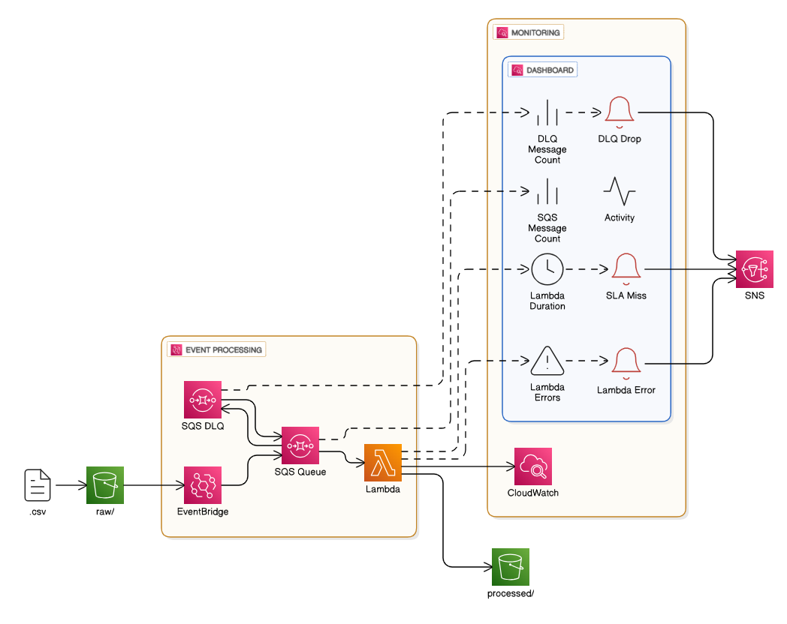
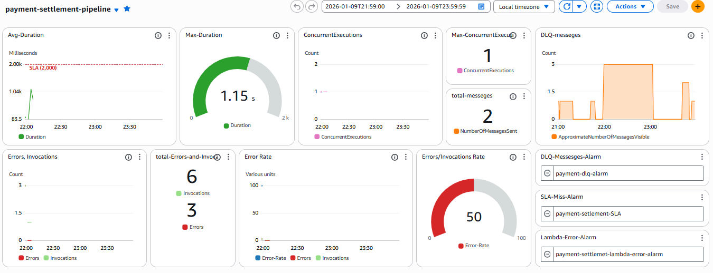

## Problem Statement

Payment Service Providers (PSPs) generate settlement statements asynchronously. These files:

* Arrive at unpredictable times (T+N)
* May contain overlapping settlement windows
* Can be re-delivered (duplicate files)
* Must not cause double counting
* Cannot be assumed complete or ordered

The system must:

- Process each file idempotently
- Normalize and store for analytics
* Scale automatically with event volume
* Provide operational visibility and alerting
* Tolerate retries and partial failures without corrupting data

---
## Architecture



**High-Level Flow**

1. Raw settlement CSV uploaded to S3
2. S3 event routed through EventBridge
3. EventBridge delivers event to SQS
4. Lambda consumes SQS messages
5. File-level idempotency check using S3 ETag
6. Data is validated, transformed, and enriched
7. Output written as Parquet, partitioned by settlement date
8. Metrics and logs emitted to CloudWatch
9. On failure beyond retry limits, the message is sent to DLQ
10. Alarms sent through SNS if something goes wrong

**S3 Storage Structure**

```text

s3://payment-settlement/
│
├── raw/
│   ├── arrival_date=2023-08-01/
│   │   ├── settlement_20230801_150000.csv
│   │   ├── settlement_20230801_180000.csv
│   │
│   ├── arrival_date=2023-08-02/
│   │   ├── settlement_20230802_010000.csv
│   │
│   └── arrival_date=2023-08-04/
│       ├── settlement_20230804_230000.csv
│
├── processed/
|	├── settlements/
|	│   ├── settlement_date=2023-08-01/
|	│   │   ├── part-00000-8f3a.parquet
|	│   │   ├── part-00001-a92c.parquet
|	│   │
|	│   ├── settlement_date=2023-08-02/
|	│   │   ├── part-00000-17bd.parquet
|	│   │
|	│   └── settlement_date=2023-08-04/
|	│       ├── part-00000-88ea.parquet
|	│
|	└── _processed_etags/
|	    ├── etag=9b2cf535f27731c974343645a3985328
|	    ├── etag=af02c1e3b1e9e4d9f0b9c01d44a5e221


```

---


## AWS Services Used 

**Amazon S3**
- Raw and processed data storage
- Durable, cost-effective, and event-native
- Supports object-level idempotency via ETag

**Amazon EventBridge**
- Decouples S3 from downstream consumers
- Supports event archiving and controlled replay

**Amazon SQS**
- Acts as the control plane for processing
- Buffers event bursts and regulates Lambda concurrency
- Enables retry semantics and DLQ handling

**AWS Lambda**
- Stateless, event-driven processing
- Scales automatically with file volume
- Suitable for lightweight transformation workloads

**Amazon CloudWatch**
- Centralized logging and metrics
- Alarms for failures, DLQ depth, and SLA breaches

**Amazon SNS**
- Distributes alarm notifications to operators


---


## About data

#### Data Source

This pipeline processes settlement statements generated by **Adyen** (Payment Service Provider).The data model, file structure, and settlement semantics follow [Adyen’s settlement report specifications](link)

- Payment Service Providers (PSPs) generate settlement statements asynchronously.
- Arrive hours or days late (T+N)
- Multiple files can arrive same day
- May contain overlapping settlement windows
- Can be append‑only and not guaranteed to be complete per delivery

#### Data Characteristics

- Data is append-only ledger data, not updates (payment settlement files are ledger like )
- Source format is CSV
- The same transaction may appear again due to adjustments
- Low individual file size (MBs),but frequent arrival
- Contain multiple booking dates in a single file


---


## Data Transformation Logic

**Column Handling**

* Spaces removed and snake_case enforced
* Renamed particular columns
* UTC and local (AMS) timestamps preserved
* Settlement date derived from booking date
* Unused fields dropped

**Financial Normalization**

* Gross / Net amounts cast to numeric
* Charges aggregated into `total_charges`
* Rows without PSP reference dropped

	`Rows without a psp_reference represent ledger-level entries (e.g., fees or balance transfers) rather than individual payment transactions. Since the downstream use case is transaction-level settlement analytics, these records are excluded from this dataset and can be persisted separately for reconciliation or accounting purposes.`

**Partitioning Strategy**

* Partitioned by `settled_date`
* Append-only Parquet dataset


---


## Schema Overview

The processed dataset contains the following logical field groups:

- **Transaction Identifiers**
  - psp_reference
  - merchant_account

- **Time Attributes**
  - creation_date_utc
  - creation_date
  - booking_date_utc
  - booking_date
  - settled_date (partition)

- **Monetary Amounts**
  - gross_amount
  - net_amount
  - gross_currency
  - net_currency
  - exchange_rate

- **Charges & Fees**
  - commission
  - markup
  - scheme_fees
  - interchange
  - dcc_markup
  - total_charges

- **Payment Attributes**
  - payment_method

- **Settlement Metadata**
  - type
  - batch_number


---


## Idempotency Strategy

**File-Level Idempotency**

* Each processed file’s S3 Object ETag is recorded at `s3://<bucket>/processed/_processed_etags/`
* Lambda checks for the ETag marker before processing
* If the marker exists, the file is skipped

	`This guarantees exactly-once processing at the file level, even if the same file is re-uploaded under a different name or replayed via EventBridge.`

**Row-level idempotency**

- Row-level idempotency is intentionally not enforced 
- Each settlement record is identified by a `psp_reference`
- A single psp_reference may legitimately appear multiple times, representing different financial events such as : `settlement , chargeback , balance transfer`
- These rows are not duplicates, but distinct state transitions in the payment lifecycle

	`Deduplication or state resolution is deferred to downstream processing (e.g., reconciliation or warehouse logic)`

**Why ETag?**

* Native to S3
* No external database required
* Cheap and reliable for file-level deduplication


---


## Failure Handling & Reliability

**SQS Queue**

- Buffers bursts of S3 events
- Controls concurrency
- Retries transient failures
- Moves poison messages to DLQ after max receives

**DLQ Usage**

- Only permanently failing files are sent to DLQ
- Transient failures rely on SQS retry semantics
- Messages can be selectively redriven after remediation

**CloudWatch Alarms**

- Lambda error count alarm to detect processing failures
- Lambda timeout / SLA miss alarm to detect execution duration breaches
- DLQ alarm to identify poison message accumulation
- Alarm notifications routed through SNS for operational visibility

**Event Replay**

- EventBridge archive enabled
- Allows controlled reprocessing of historical events


---


## Monitoring & Alarms

**CloudWatch Metrics**

* Lambda Invocations
* Lambda Errors
* Lambda Duration
* DLQ Messages
* Concurrent Executions
 

**Alarms Configured**

* DLQ message count > 0
* Lambda error threshold
* SLA miss detection > 2s

**Logs**

- Rows read, written, dropped
- details of partitions 
- memory usage 
- Execution duration

**Dashboard**

* Aggregated operational visibility
* Near-real-time (not live-streaming)




---


## Design Tradeoffs

- Append-only writes are used instead of overwrites to safely accommodate late-arriving and corrected settlement records.
- Row-level idempotency is intentionally avoided to preserve the full financial event lifecycle 
- Lambda-based processing is chosen over distributed engines to optimize for low-volume, many-file workloads.
- No external state store is introduced to keep ingestion stateless and reduce operational complexity.
- Partial writes are accepted to keep ingestion stateless and avoid complex coordination or locking mechanisms.


---


## Cost Considerations

* Fully serverless (pay-per-use model)
* No always-on compute resources
* No external state store (e.g., DynamoDB) for idempotency
* Automatic scaling with event volume

This architecture is optimized for **low to moderate daily volume** with unpredictable arrival patterns.


---


## Future Improvements

* Introduce AWS Glue Data Catalog for schema management and discovery
* Enable Athena-based analytical querying over processed data
* Add schema evolution handling
* Migrate processed layer to a transactional table format (Iceberg / Hudi) for ACID guarantees


